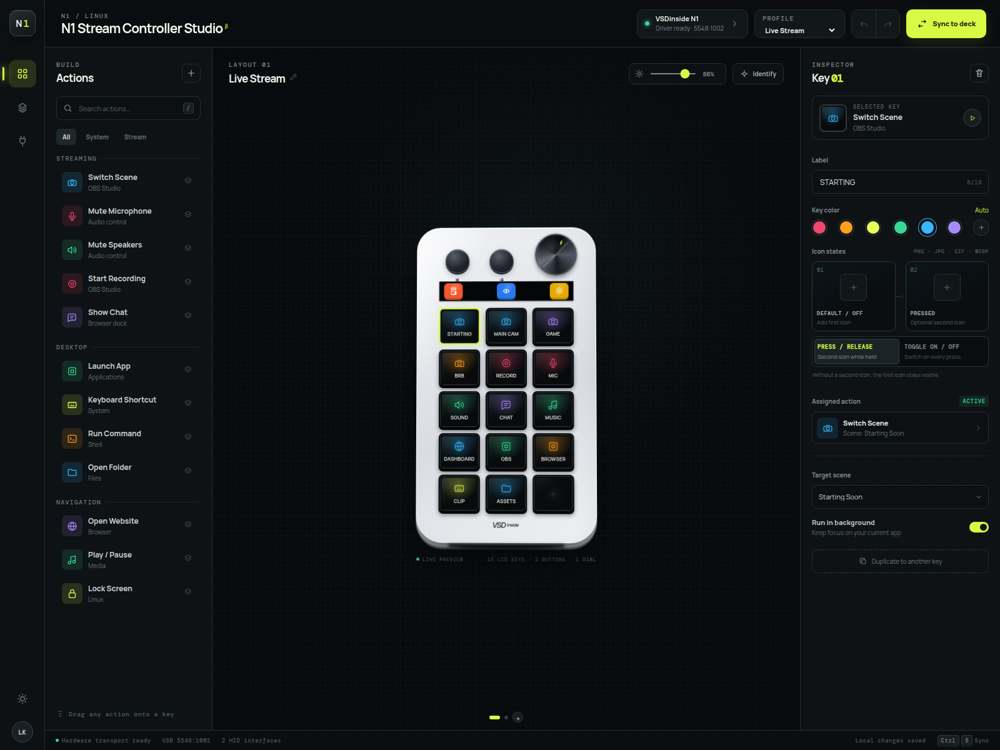

# N1 Stream Controller Studio

## ⚠️ EARLY ALPHA — DO NOT USE ⚠️

> [!CAUTION]
> **This software is currently EARLY ALPHA and is unsafe to use.**
> Do not use it with your hardware or rely on it for production workflows.
> **Wait for the BETA release before using this software.**

A Linux-first configuration UI and hardware service for the TreasLin VSDinside N1
stream controller.



## First-time setup

Install the pinned vendor SDK and the narrowly scoped udev permission rule:

```bash
npm run setup:driver
```

The setup command may ask for your sudo password while installing the udev rule. Unplug
and reconnect the N1 afterward.

If `.venv` is already present and only USB permission is missing, run:

```bash
npm run setup:udev
```

Start the application on any free port:

```bash
PORT=4197 npm run dev
```

Open `http://127.0.0.1:4197` in Chromium.

## What works

- Detects the legacy TreasLin USB identity `5548:1002`
- Uploads native 96×96 JPEG images to all 15 LCD keys
- Updates the three small status-strip displays
- Clears empty key slots and commits the display refresh
- Applies physical display brightness
- Maintains profiles and local drafts
- Listens for buttons and rotary-dial events through the vendor HID interface
- Runs explicit shell actions and built-in Linux media/session actions on key presses
- Streams hardware and action status back into the browser UI

The **Sync to deck** button performs a real hardware transfer. Failed USB access is
reported as an error and never presented as a successful sync.

## Commands

```bash
npm run check          # JavaScript, Python, and shell syntax checks
npm run driver:probe   # Open the N1 and report driver status
npm run setup:driver   # Install SDK dependencies and udev permissions
npm run setup:udev     # Install only the USB permission rule
```

See [docs/HARDWARE.md](docs/HARDWARE.md) for device details, safety boundaries, and the
optional USB capture workflow.
