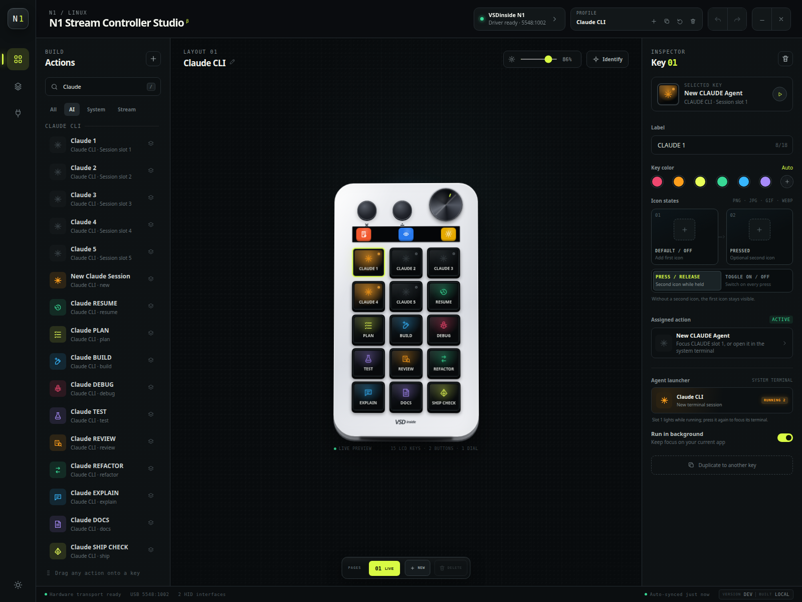

# N1 Stream Controller Studio

## ⚠️ EARLY ALPHA — LOOK, DON’T RELY ⚠️

> [!CAUTION]
> **This software is still EARLY ALPHA and is unsafe for production use.**
> Do not trust it with critical hardware or live workflows yet. Wait for the BETA
> release if “nothing surprising happens” is part of your job description.

### Fifteen LCD keys. Three status screens. One delightfully overqualified Linux command center.

N1 Stream Controller Studio turns the TreasLin VSDinside N1 into a native,
auto-syncing control surface for streaming, editing, desktop chores, soundboards,
screenshots—and your favorite coding agents.



## The 30-second sales pitch

Are you tired of typing commands with your *entire keyboard*? Would you like a glowing
button labeled **DEBUG** to summon an AI agent in a fresh terminal? Have you ever
thought, “This screenshot needs fewer clicks and considerably more hardware”?

Good news! N1 Stream Controller Studio currently delivers:

- Six ready-made profiles: Live Stream, Video Edit, Daily Desk, Codex CLI, Claude CLI,
  and Gemini CLI
- Native 96×96 key artwork, animated icons, two-state buttons, and automatic hardware sync
- Add, duplicate, delete, and factory-reset profile controls
- Up to eight pages per profile, with physical profile and page switching
- Full-screen, area, and window screenshots with save-or-copy-to-clipboard behavior
- Sound buttons with waveforms, playheads, loops, restart/stop modes, and live playing colors
- Reusable AI Session and custom AI Prompt actions plus ten focused AI workflows
- Live color-coded session keys that show which CLI terminals are running
- Safe action previewing without accidentally replacing a deck key
- Optional per-user start on login, launching Studio quietly in the system tray
- Native startup and USB-reconnect restoration, so the deck comes back without an editor nudge

That’s right: it slices, it dices, and it puts **SHIP CHECK** on a physical button.

## Install the latest release

On x86_64 Debian, Ubuntu, or Linux Mint, the installer downloads the newest Debian
package, verifies its checksum and signed GitHub Actions provenance, installs its
dependencies, and configures N1 USB permissions. A current GitHub CLI with
`gh attestation verify` support is required.

```bash
curl -fsSL https://raw.githubusercontent.com/plasticparticle/n1-stream-controller-studio/main/install.sh \
  | bash -s -- --accept-alpha-risk
```

The explicit flag is required because this is still unsafe EARLY ALPHA software.
Prefer to inspect the merchandise before bringing it home?

```bash
curl -fsSLO https://raw.githubusercontent.com/plasticparticle/n1-stream-controller-studio/main/install.sh
less install.sh
bash install.sh --accept-alpha-risk
```

Use `--version TAG` for a particular release or `--dry-run` to download and validate
without changing the system. Running the installer again upgrades an existing
installation. The unsafe `--skip-attestation` escape hatch exists for development
releases whose provenance cannot be retrieved; it is not for normal installation.

## Your profiles, now with actual profile powers

The profile switcher can:

- **Add** a blank profile
- **Duplicate** every page, action, icon, and sound setting
- **Reset** a built-in profile to its factory layout
- **Reset** a custom profile to one pristine empty page
- **Delete** a profile after confirmation

The top-left physical button cycles profiles. The middle physical button cycles pages.
The left status display prints the active profile name, the center display shows the
current page, and the right display keeps the brightness indicator close at hand.

Every layout edit is saved locally and queued for the N1. Rapid edits are debounced,
USB transfers are serialized, and the native core restores the active deck when Studio
starts or the controller reconnects.

## The AI coding command center

Codex, Claude, and Gemini each receive a 15-key factory profile:

| Profile row | Buttons |
| --- | --- |
| Session bank | Model 1–5, each uniquely named and monitored |
| Workflow row one | Resume, Plan, Build, Debug, Test |
| Workflow row two | Review, Refactor, Explain, Docs, Ship Check |

The dedicated **AI** catalogue stays intentionally compact:

- One reusable **AI Session** action
- One reusable **AI Prompt** action with a per-button prompt
- One copy of each of the ten focused workflows

Drop **AI Session** more than once and Studio assigns the lowest available model
number automatically: `CLAUDE 1`, `CLAUDE 2`, and so on. The label is the session ID,
so it must be unique. Duplicating a session key or an entire profile also assigns new
numbers instead of cloning an identity.

Every AI key has a model selector for Codex, Claude, or Gemini. Changing it updates the
built-in provider icon on sessions and renumbers an automatically named session for the
new model. Workflow and prompt keys retain their semantic icon—Plan, Debug, Docs, and
so on—and show the selected model in a small colored badge. Uploaded custom icons and
custom unique labels stay untouched. The dedicated factory profiles remain
preconfigured for their respective model.

Drop **AI Prompt**, choose its model and project, then write up to 1,000 characters in
the inspector. Pressing the key opens the selected CLI with that saved prompt. Prompts
are passed directly as process arguments rather than through a shell, so punctuation
and shell-like characters remain literal text.

Sessions open through the system-configured `x-terminal-emulator`. Studio tags each
terminal with its model, unique label, and project; pressing the same key again focuses
that exact terminal instead of manufacturing another window. `wmctrl` supplies window
activation and is recommended by the Debian package.

Tagged sessions light their exact key:

- Codex: electric blue
- Claude: hot orange
- Gemini: violet

Only a session whose Studio-tagged CLI process and terminal window are both still live
illuminates its key. Manually started and background CLI processes are ignored, so an
unrelated Codex process cannot impersonate **Codex 1**. Status means
reliably **running** or **idle**; Studio does not pretend it can read an agent’s mind
and guess whether it is thinking, waiting, or asking for approval.

Built-in AI launchers use fixed arguments and do not require shell-action opt-in.
Studio searches `PATH` plus common user installation directories for each CLI.

Every Codex, Claude, and Gemini key can target its own project directory. Select an
assigned AI key, open **Agent launcher → Project directory**, and either type an
absolute path or choose a folder with the native picker. Studio validates and
canonicalizes the directory before saving it, launches the terminal from that folder,
and includes the project in session identity so one repository cannot steal
focus—or borrow the running indicator—from another. Leaving the field empty uses the
Studio project directory.

## Preview first, commit to the button later

Click a blank area of the editor—or press Escape—to deselect the current deck key.
With no key selected, clicking an action opens a cyan, read-only inspector preview and
does not touch the board.

- Click an action while a key is selected to assign it
- Drag an action onto any key to assign it directly
- Use the inspector’s play button to test a previewable action

It is the software equivalent of “look, but don’t accidentally overwrite the button
that starts the stream.”

## Soundboard deluxe

Choose a WAV, MP3, OGG, or FLAC file and the key immediately adopts the filename as its
label when the label is still blank or generic. Long names are shortened to fit.

Sound keys provide:

- A generated waveform on the editor and physical key
- A live horizontal playhead
- A brighter playing background
- Stop-on-second-press or restart-on-second-press behavior
- Continuous looping until the key is pressed again
- Click-to-preview audio from the inspector key

## Screenshots at the speed of button

The Capture action group includes:

- Full screen
- Selected area
- Active window

Each screenshot action can save a timestamped PNG in `Pictures/Screenshots` or copy
the result directly to the clipboard. Studio tries the supported desktop utilities
available on the host.

## Make every key look expensive

Select a key and use **Icon states** to upload PNG, JPEG, GIF, or WebP artwork.
Each key supports:

- **Default / off** artwork
- **Pressed / on** artwork
- **Press / release** behavior
- **Toggle on / off** behavior

Static and animated images are fitted to the N1’s native 96×96 display. Uploaded art
syncs as soon as it is ready; animations begin after the queued transfer completes.

## Native architecture, no mystery web server included

Studio is a Tauri 2 desktop application. The HTML, CSS, and JavaScript interface is
bundled into the app and talks to Rust through in-process Tauri commands and events.
There is no local web server and no listening TCP port.

```text
HTML/CSS/JavaScript interface
          ↕ Tauri IPC
Rust desktop core and tray
          ↕ stdin/stdout
Bundled Python N1 sidecar
          ↕ USB/HID
      VSDinside N1
```

Closing the window hides it while the controller remains active. Left-click the tray
icon to reopen Studio; right-click it for **Open Studio** and **Quit**.

Open **Studio settings** from the gear in the left rail to enable **Start on login**.
Studio registers a per-user desktop autostart entry—no root access required—and launches
hidden in the tray after sign-in. The native core immediately starts the bundled driver
and restores the last active deck when the controller is available.

For report geometry, reconnect behavior, status-display mapping, and USB capture,
step into the glamorous engineering annex:
[docs/HARDWARE.md](docs/HARDWARE.md).

## Build and run from source

The current build targets x86_64 Linux and has been tested on Linux Mint 22.3
(Ubuntu 24.04 base).

Install Node.js, Python, and the native Linux build dependencies:

```bash
sudo apt install libwebkit2gtk-4.1-dev build-essential curl wget file \
  libxdo-dev libssl-dev libayatana-appindicator3-dev librsvg2-dev patchelf \
  nodejs python3.12 python3.12-venv git wmctrl
```

Rust is also required. Install it from the
[official Rust installer page](https://www.rust-lang.org/tools/install), then open a
new terminal or load Cargo into the current shell:

```bash
source "$HOME/.cargo/env"
cargo --version
```

Prepare the JavaScript tooling, pinned vendor SDK, Python environment, and USB rule:

```bash
npm install
npm run setup:driver
```

Unplug and reconnect the N1 after installing or updating the udev rule. Then start
the native application:

```bash
npm run dev
```

The first run builds the Rust application and packages the Python hardware bridge
into a self-contained sidecar.

## Build a Debian package

```bash
npm run build
```

The package appears below `src-tauri/target/release/bundle/deb/` and includes the
native application, frontend, and hardware sidecar. Node.js, Rust, Python, and
`.venv` are build-time requirements only.

The host still needs the N1 USB permission rule. From this repository, install or
update it with:

```bash
npm run setup:udev
```

Then unplug and reconnect the controller.

## Shell-action security

Custom commands, launch actions, and hotkey command strings run with your user account
and are disabled by default. To opt in for a trusted local profile:

```bash
N1_STUDIO_ALLOW_SHELL_ACTIONS=1 n1-stream-controller-studio
```

Built-in actions—including fixed AI workflows, websites, folders, screenshots, and
sound playback—do not require this opt-in. Never enable shell actions for a profile
you did not create and inspect.

## Operator’s command card

```bash
npm run dev            # Start the native Tauri application
npm run build          # Build the Debian package
npm run check          # Run syntax, formatting, sidecar, and native tests
npm run driver:probe   # Open the N1 and report driver status
npm run setup:driver   # Install SDK dependencies and USB permissions
npm run setup:udev     # Install only the USB permission rule
```

Now press **BUILD**, watch the terminal appear, and enjoy the suspiciously satisfying
feeling of turning software development into a control-room montage.
